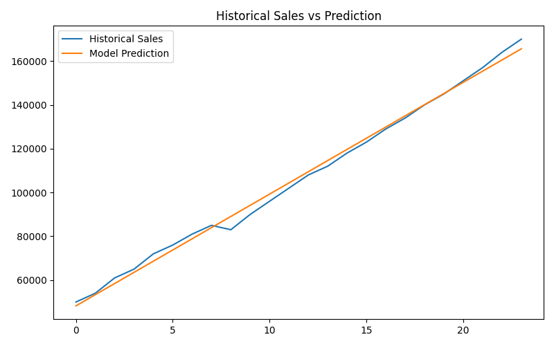
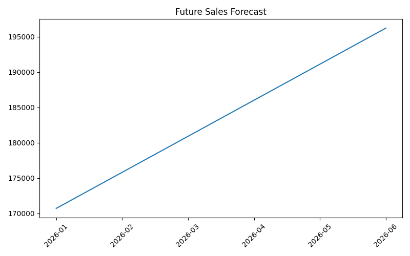

# Predictive Analytics Forecasting

## Project Overview
This project uses machine learning and historical sales data to forecast future business trends.

## Features
- Historical data preprocessing
- Linear Regression forecasting model
- Model evaluation using MAE and R² score
- Future sales forecasting
- Business trend visualization
- Saved trained model

## Technologies Used
- Python
- pandas
- matplotlib
- scikit-learn
- joblib

## Model Performance
- MAE: 2121.88
- R² Score: 0.9948

## How to Run
```bash
pip install -r requirements.txt
cd notebooks
python predictive_model.py
```

## Output Screenshots

### Historical vs Prediction


### Future Forecast
